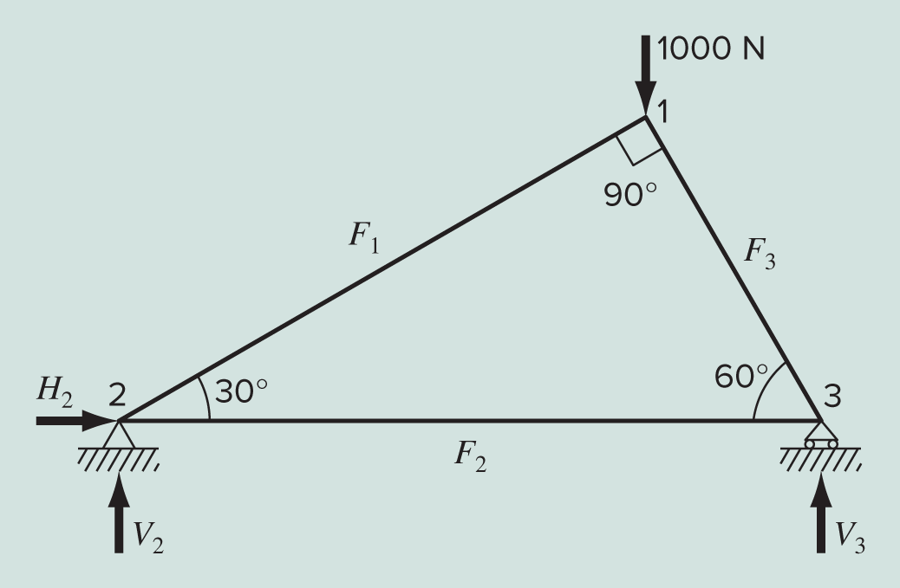
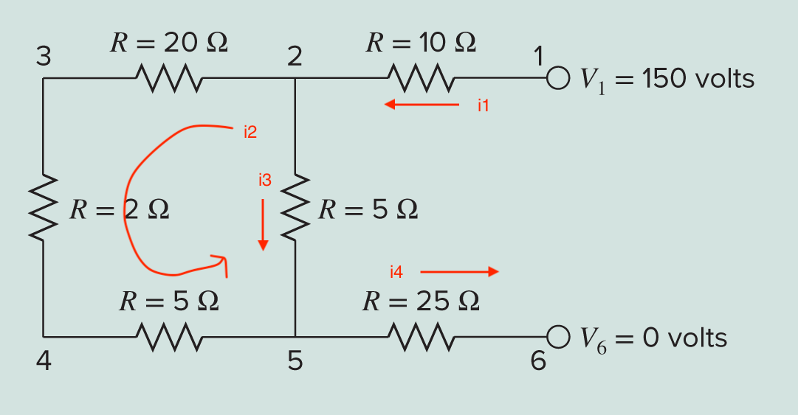

# Computing with Matrices

## Introduction

Suppose your engineering course is modeling a system of linear equations, which can be written with matrices. Systems like this are common in mechanics and electrical engineering, as well as other fields. A system of linear equations can be represented as a matrix equation, and solving matrix equations is an important use of computing!

You might suppose NumPy offers functionality, since matrices are just two dimensional arrays. You might search "numpy.org matrices," which may result in a hit for NumPy's [matrix](https://numpy.org/doc/stable/reference/generated/numpy.matrix.html) class. You know the importance of critically evaluating documentation, so you read the note that the matrix class is no longer recommended, and you should use arrays instead!

The next search result may be for the beginner documentation, so you review [Creating Matrices](https://numpy.org/devdocs/user/absolute_beginners.html#creating-matrices) and refresh your memory for ways to create arrays.

## Matrix Operations

Create a file `matrices.py` to work in.

### Dimensions and Size

Write the function `describe`, which has one parameter, the array to describe. This function prints 1) the array itself, 2) its shape, and 3) its data type. Print a newline after 1) and 3), such as:

```
[[ 6 -1]
 [12  8]
 [-5  4]]
(3, 2) int64
```

Write a `main` function that creates three test matrices:

```python
a = np.array([[6, -1], [12, 8], [-5, 4]])
b = np.array([[4, 0], [0.5, 2]])
c = np.array([[2, -2], [3, 1]])
```

In `main`, call `describe` on each matrix.

### Multiplication

Find the math domain knowledge for the conditions under which two matrices can be multiplied. 

Write the function `multiply`, which takes two parameters, the matrices to multiply. If the matrices cannot be multiplied, this function should print a message about their dimensions and return None. Otherwise, it should return their matrix product. (Look up in the NumPy documentation how to multiply two matrices.)

Test this function in `main` by attempting to multiply every pairing of `a`, `b`, and `c`. If the result is not None, print the result.

### Determinant and Inverse

Two matrix properties you have learned about are *determinant* and *inverse*. The determinant is a scalar that is useful in characterizing some matrix properties. Only square matrices have determinants. The inverse is the matrix that when multiplied by the original matrix gives the identity matrix. Only square matrices have inverses.

Write the function `determinant`, which has one parameter, the matrix to find the determinant of. If the input is not square, this function should print a message and return None. Otherwise, it should return the determinant of the matrix.

Write the function `inverse`, which has one parameter, the matrix to find the inverse of. If the input is not square, this function should print a message and return None. Otherwise, it should return the inverse of the matrix.

Hint: the NumPy functions are in the `linalg` module.

Test both of these functions by calling them in main on each of your test matrices.

## Solving Systems of Linear Equations

One can write a system of linear equations in the form $Ax = b$, where $A$ is the coefficient matrix, $b$ is the output vector, and $x$ is the vector of unknowns to solve for.

Write the function `solve_linear_system`, which takes three parameters:

1. `a`, the coefficient matrix,
2. `b`, the output vector, and
3. `unknowns`, which is a list of strings for the names of the unknown variables.

This function should use NumPy to solve the system of linear equations, i.e., find `x`. Then it should create and return a dictionary, where each key is the name of the unknown variable, and its value is the result of solving for `x`.

Define the helper function `check_solution`, which multiplies $A$ and $x$ to make sure we get $b$, and call it in your function.

```python
def check_solution(a, b, x):
    # multiply A*x and make sure we get b
    assert np.allclose(np.dot(a, x), b)
```

To test your function, consider the following system of equations:

$$
\begin{align*}
&50 = 5 x_3 - 7 x_2\\
&4x_2 + 7 x_3 + 30 = 0\\
&x_1 - 7 x_3 = 40 - 3 x_2 + 5 x_1
\end{align*}
$$

1. Write the equations in matrix form $Ax = b$.
2. In main, write code such that variable `a` is the coefficient matrix and `b` is the column vector of constant terms.
3. Call `solve_linear_system`, and print the result.

## Forces in a Truss

In structural engineering, a truss is a structure that can be described by a system of coupled linear algebraic equations derived from force balances. (Hi EGR 201!)

Consider the following truss with load 1000 N, and reaction forces $H_2$, $V_2$, and $V_3$. 



By performing a force balance at each node (Recall $F=ma$, and we want $a=0$ for a truss!), one finds:

$$
\begin{align*}
&\sum_\text{node 1} F_H = 0 = -F_1 \cos30 + F_3 \cos60\\
&\sum_\text{node 1} F_V = 0 = -F_1 \sin30 - F_3 \sin60 - 1000\\
&\sum_\text{node 2} F_H = 0 = F_2 + F_1 \cos30 + H_2\\
&\sum_\text{node 2} F_V = 0 = F_1 \sin30 + V_2\\
&\sum_\text{node 3} F_H = 0 = -F_2 - F_3 \cos60\\
&\sum_\text{node 3} F_V = 0 = F_3 \sin60 + V_3\\
\end{align*}
$$

Write this system of equations as a matrix equation.

Now, write write code to solve for the internal forces and reaction forces. Write the file `truss.py`, which should:

1. Import your `solve_linear_system` function from the `matrices` module.
2. Define a main function with the `a` and `b` matrices.
3. Call your `solve_linear_system` to solve the system.
4. Print out the solution for each unknown, naming each one with a capital letter and number, one result per line, such as:

```
F1 = -500.00
```

5. Interpret the results physically: Do the force balance equations assume each member is in tension or compression? What does a negative solution to the unknown mean physically? Do your solutions make sense?

## Current and Voltage in a Circuit

Consider the following circuit with the labeled resistances.



Kirchhoff's laws tell us the the net current into a node is zero, and the net voltage around a loop is zero. Ohm's law says the voltage drop across a resistor is the resistance times the current through it.

From Kirchhoff's current law, the nodal equations are
$$
\begin{align*}
&i_1 = i_2 + i_3\\
&i_2 + i_3 = i_4\\
\end{align*}
$$

From Ohm's law, the voltage drops are
$$
\begin{align*}
v_1 - v_2 &= i_1(10)\\
v_2 - v_3 &= i_2(20)\\
v_3 - v_4 &= i_2(2)\\
v_4 - v_5 &= i_2(5)\\
v_2 - v_5 &= i_3(5)\\
v_5 - v_6 &= i_4(25)\\
\end{align*}
$$

Hint: How many unknowns and how many equations are there? (Make sure you use the figure.)

Write the file `circuit.py`, which does the following:

1. Import your `solve_linear_system` function.
2. Form a matrix equation, and solve it for the circuit currents and node voltages.
3. Print your results, naming each unknown variable with a lowercase letter and number, like:

```
i1 = 3.82
```

## Submission

Submit your three code files to Gradescope for autograding.