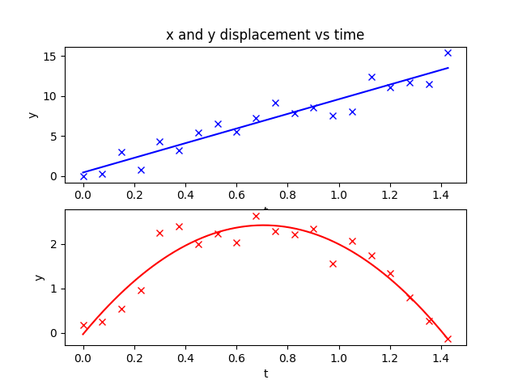

# Discussing the Orders of the Pots
2 plots were plotted about the x-axis displacement against time, and the y-axis displacement agaist time. 

The first plot, x against t, seemed to just have a positive relation, therefore, the polynomial order chosen for this was 1. The resulting coefficients recieved by using the polyfit function of numpy were [9.14071265 0.44237167]. This results in the equation:

$$
\begin{aligned}
\boxed{x = 9.14071265t + 0.44237167}
\end{aligned}
$$

The second plot, y against t, seemed to have a positive relation at first, then a negative one. This a polynomial order of 2 was chosen for this. The resulting coefficients were [-4.92667889  6.95331552 -0.03206391]. This results in the equation:

$$
\begin{aligned}
\boxed{y = -4.92667889t^2 + 6.95331552t + -0.03206391}
\end{aligned}
$$

# How close was the Line of Best Fit to the Plots

Overall, the markers seem relatively close to their respective Lines of Best Fit. Although there are some outliers which are slightly more deviated than the other markers, the deviations are not extreme.

# Physics Behind the Graphs

By observing the graphs, they seem to be modelling a projectile which has been launched from the ground, since the y-intercept of plot 2 is almost = 0.

We know that the derivative of displacement against time graphs gives us the velocity against time graph, and differenciating it further gives acceleration against time.

Velocity against time graphs:

$$
\begin{aligned}
\boxed{v_x = 9.14071265}
\end{aligned}
$$

$$
\begin{aligned}
\boxed{v_y = -9.85335778t + 6.95331552}
\end{aligned}
$$

Acceleration against time graphs:

$$
\begin{aligned}
\boxed{a_x = 0}
\end{aligned}
$$

$$
\begin{aligned}
\boxed{a_y = -9.85335778}
\end{aligned}
$$

The equations for acceleration tell us that air resistance is either negligible, or unnaccounted for in this model. This is because, the acceleration on the $ x $ direction is 0, which means there is no net force on the $ x $ direction. Similarly, the acceleration on the $ y $ direction is -9.85335778, which is approximately = acceleration due to free fall, $ g $. This shows that the only force on the $ y $ direction is gravity.

Therefore, there is no air resistance on the projectile.

# Finding the Initial Launch Velocity and Launch Angle of the Projectile

To find the launch velocity of the projectile, we can find the initial velocities in both $ x $ and $ y $ direction. When $ t = 0 $, $ v_x $ and $ v_y $ are just the respective y-intercepts.

$$
\begin{aligned}
\boxed{v_x(0) = 9.14071265}
\end{aligned}
$$

$$
\begin{aligned}
\boxed{v_y(0) = 6.95331552}
\end{aligned}
$$

To find the launch velocity, we can use pythagoras theorem:

$$
v_0 = \sqrt{v_x(0)^2 + v_y(0)^2}
= \sqrt{(9.14071265)^2 + (6.95331552)^2}
$$
$$
\boxed{v_0 \approx 11.49\ \text{m/s}}
$$

To find the launch angle, we can use trignometry:

$$
\tan(\theta) = \frac{v_y(0)}{v_x(0)}
$$

Substitute the given values:

$$
\tan(\theta) = \frac{6.95331552}{9.14071265}
$$

$$
\theta = \tan^{-1}\left(\frac{6.95331552}{9.14071265}\right)
$$

$$
\boxed{\theta \approx 37.2^\circ}
$$