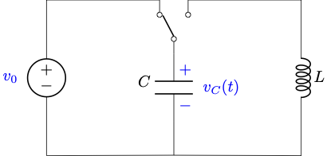

# Modeling an LC Circuit

## Background

In electrical engineering, there are several passive circuit elements, that is, they do not generate power. Two we will discuss in this lab are *inductors* and *capacitors*. 

An inductor is a coil of a conductor that stores energy in its magnetic field (remember Ampere's Law and Faraday's Law?). The voltage across an inductor is proportional to the time rate of change of the current through it.

A capacitor is basically a sandwich of two conductors with a dialectric (non-conductor) in the middle, which stores energy in its electric field. The current through a capacitor is proportional to the time rate of change of the voltage across it.

In this activity, we will consider the following simple circuit with a voltage source, capcitor, and inductor. 

*LC circuit*

When the switch is closed, the differential equation for the voltage across the capacitor is given by

$$\frac{d^2 v_c}{dt^2} + \frac{1}{LC} v_c = 0,$$

where $v_c$ is the voltage across the capacitor, $L$ is the inductance (in Henrys), and $C$ is the capacitance (in Farads).

The solution to this differential equation gives the voltage across the capacitor as a function of time.

$$v_c = v_0 \cos\left(\sqrt{\frac{1}{LC}}~t\right)$$

## Experimental analysis

Suppose you have run an experiment on such a system and measured the voltage, with your data in file `lc_circuit_data.txt`.

You know you set the voltage source to 5V before the switch was closed, and you read the manufacturer's rating on the components to be 20 mH and 5 F. However, you would like to  determine the model parameters from the data and check them against the manufacturer's information.

In this tutorial, you will learn how to fit an arbitrary math model to data. The library SciPy provides curve fitting functionality with its `scipy.optimize.curve_fit` function. See its [documentation](https://docs.scipy.org/doc/scipy/reference/generated/scipy.optimize.curve_fit.html).

## Algorithm

The algorithm we suggest you implement in main is:

1. Read data from file `lc_circuit_data.txt` into arrays
2. Plot the data from the file (time on x, voltage on y)
3. Find the best fit model parameters for the cosine model (this is what we will use `curve_fit` for)
4. Generate an array of voltages from the model
5. Plot the model over the data points
6. Save the figure as `lc_circuit_plot.png`

## Provided

This activity provides the function `get_lc_model`, which demonstrates how to use `curve_fit` to fit an arbitrary function to a data set. Read the comments carefully!

We provide part of a function to read the data from a file. `get_data` uses `np.loadtxt` to read two columns of data into one array with two dimensions.

## For you to write

### `main`

Write a main function according to the algorithm, using the defined functions.

### `get_data`

Finish this function by writing the code to make each of `t` and `vc` a 1D array that is one column from the 2D data.

### `voltage_lc_circuit`

Write this function according to the equation for the voltage model.

## Put together

When you run the complete program, it should fit a cosine curve to the data and plot the data and best fit model!

## Submission

Submit your `fit_data.py` code file and `lc_circuit_plot.png` to the Gradescope autograder.