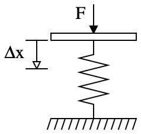
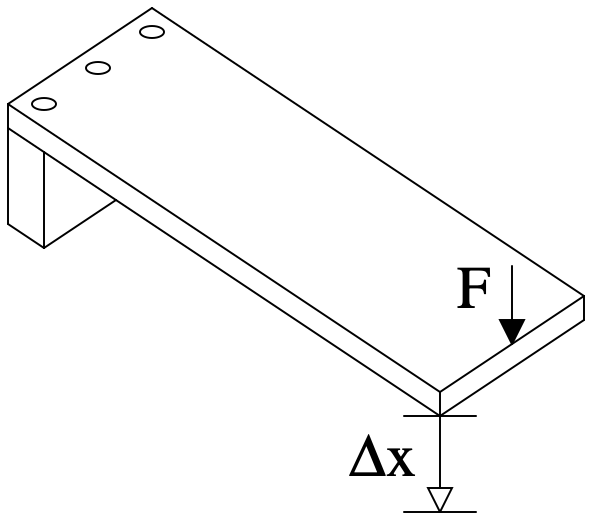

# Lab 5: Cantilever Beam

## Overview

In this lab you will practice loading, interpreting, and displaying numerical data with Python. Specifically, you will take a data set from an engineering experiment measuring the deflection of a cantilever beam subject to different loadings. You will analyze it to determine whether the experimental apparatus behaves according to a proposed physical principle, Hook's law. 

## Learning outcomes

Successfully completing this lab will demonstrate your ability to:

* Load data from a file;
* Perform calculations to convert the data to a usable form;
* Model the data with a proposed physical principle; and
* Create visualizations to show results.

## Collaboration Policy

This lab is intended to be collaborative. You are encouraged to ask questions of classmates and work through the math together. However, your submission must represent your own understanding of the assignment. You may not copy another person's code.

The reflection component of this assignment is individual.

## AI Policy

**Code allowable use: AI Tutor**  
AI can be used to answer questions a TA would be willing to answer. You may ask conceptual questions.

You may *not* use AI to generate code, either in part or wholesale.

**Reflection allowable use: AI-assisted editing**  
AI can be used to make improvements to the clarity or quality of your reflection. In this assignment, that means that answering the reflection questions must be done by you. You may (but do not have to) use AI to help you edit the language for the ideas you yourself came up with.

## Instructions

### Background

We will be using measurements from a real-life situation, namely the deflection of a cantilever beam. A cantilever beam is an object that is fixed at one end but free at the other, much like a diving board. The question we will trying to answer is,

> "Does a cantilever beam act like a regular spring?"

The scientific way of asking this question is,

> "Does Hooke's Law model a cantilever beam over some limited range of deflections?"

Hooke's Law states that the displacement of a spring is directly proportional to the force applied to the spring:

$$
 F = k \Delta x 
$$




### Specifications

You will write a program to analyze and plot data sets to help answer the above question. We recommend starting by analyzing and plotting `cantilever.dat` before generalizing your program to process all data files.

#### Data

The data files are in a subdirectory `data` and each has a `.dat` file extension.

Each data file contains information obtained from an experiment where objects of known mass (in kg) were placed on the end of an instrumented cantilever beam. The deflection at the far end of the beam was then measured (in inches) and stored in the data file. The data is tab-separated, meaning a tab (`\t`) character separates the mass and deflection data on each line.

Because the amount of force applied is the independent variable and the deflection is the dependent variable, the equation we will be looking at has deflection (analogous to spring displacement) as a function of force:
$$
\Delta x = \frac{1}{k}F+(\Delta x)_0
$$

where $\frac{1}{k}$ is the spring's compliance, and $(\Delta x)_0$ is the initial displacement of the end of the spring.

In order to answer the above question of whether a cantilever beam acts the same as a spring, we will take data from the experiment, mathematically determine the compliance and initial deflection values that make the best predictions for all the data points, and then graphically determine whether it seems the equation properly predicts the data.

#### Program

Write your program in a file named `analyze_cantilever.py`. At a high-level, your program, should read each data set from a file, produce a plot with the data and its model, save each figure, and print the model parameters.

When it is completed, running your program should save plots for all data files in your `lab5` directory (not in `data`) and print the model parameters.

Each figure should have the same base name as the data file and file extension `.png`. For example, the figure produced for data file `beam1.dat` should be `beam1.png`.

The model parameters should be printed in the following format:
```
<data file>: <compliance>, <initial deflection>
```
where the compliance and deflection are printed to five significant figures using scientific notation.

Your program should only produce this output when it is run as the main program. It should not print anything when it is imported as a module.

#### Figures

Each figure should show deflection vs. force (i.e., deflection on the y-axis and force on the x-axis), plotting the experimental data as points and the model that is the best fit (using a polynomial of appropriate order) as a line. Format the plot such that grid lines are shown for both the x and y axes. Label the axes with their quantity and units. Do not title the figure, since you will caption it in your report.

#### Required function
One of your functions must be named `analyze_plot_data_file`. This function should take a path name to a data file as a parameter, plot and save the figure for that file, and return an ndarray of model parameters. The function should have a docstring. For example, if the path name were "data/beam2.dat", the function would use the data from the "beam2.dat" file in the "data" subdirectory, plot the data and save the figure as "beam2.png", and return the parameters for the model fit to that data.

You are free to include any other functions you find useful. This is the only specific function the autograder will check for.

#### Make a plan
Since you know what question you are trying to answer and what data you have, now is the time to make a plan!

Spend time describing the high-level steps you will take to perform this task. Identify any domain knowledge or technical skills you need to complete it, and identify resources now.

For example, you might need to look up how to do some steps with code.

* Perhaps you don't already know a convenient way to read in tabular data from a file. You might guess NumPy provides a convenient way to do this and look up "numpy.org read data from file."
* Your planned plotting looks complex, so you may want to find documentation or examples on how to use Figure and Axes objects.
* You might look up how to list all files in a directory or how to get the base name of a file, given its path.

As you design your program, think about what you would like to be a function for abstraction and reusability. Think about how you can avoid duplicating code.

## Submission

Recall from the course introduction that lab assignments are evaluated using specifications, the essential qualities your submission must have to be satisfactory. You can see all the specifications for this lab assignment in the rubric section of these instructions. Your submission must meet all of the specifications to receive credit. Submissions that are marked "Needs revisions" can be revised during the second submission window.

### What to submit

The submission for this lab has two parts:

* Code submitted on Gradescope
* Report submitted on Canvas

## Report Format

Your report should be typed (font size 11 or 12). It should include title and author information:

* The name of the lab
* The name of the course
* Your name (as author)
* The date

### Report Sections

For this report, include your results, a discussion, a reflection, and an appendix with your code.

#### Results

Include all four plots you generated. They must be appropriately labeled and have captions (not titles).

Produce an estimate of the compliance (slope of the linear fit) and initial deflection (y-intercept of the linear fit) for each of the data files based on your polynomial fit. Put all estimates for the three beams in one tabular environment. Clearly label which constant you are giving and for which data file. For example:

|Data File | Compliance (m/N) | Deflection (m) |
|----------|------------------|----------------|
|beam1.dat | $\alpha$         | $\beta$        |
|beam2.dat | $\gamma$         | $\delta$       |
|beam3.dat | $\varepsilon$    | $\zeta$        |

Note that the units are included in the header and are not needed in the table itself. You will replace the Greek letters above with the appropriate values. You should format these numbers using scientific notation and use five significant figures.

#### Discussion

Present the model you computed for each data set, and describe how well it fits. Specifically, include the polynomial with coefficients for each data set, typeset with an equation editor. For example, the following (unrelated) equation is typeset:
$$
k=\frac{A}{A_0}e^\frac{-E_a}{RT}
$$

and the following is not:

k = (A / A0) * exp(-Ea/RT)

Discuss what your results indicate about the applicability of Hooke's law to a cantilever beam. Describe physically why you think a cantilever beam behaves as a spring or not and if so, under what conditions.

#### Reflection

Include your answers to these reflection questions in paragraph form, in 200–500 words.

* What planning did you do prior to writing code?
* What challenges did you overcome? Discuss what the challenge was, how it related to your task, and how you approached it.
* How did you acquire new knowledge? Discuss what you learned, how you acquired the information, and how you applied it to your work.
* In one area of engineering that interests you, what is one question that visualizing and modeling experimental data could help answer?

#### Appendix

Include all of your code for this lab.

Make sure that your code is properly formatted like it appears in VS Code. Do not just copy and paste the text of your code into a word processor!

## Acknowledgments

This lab is adapted from EGR 103L Fall 2023 *Lab 2: Introduction to Python* by Michael Gustafson.
